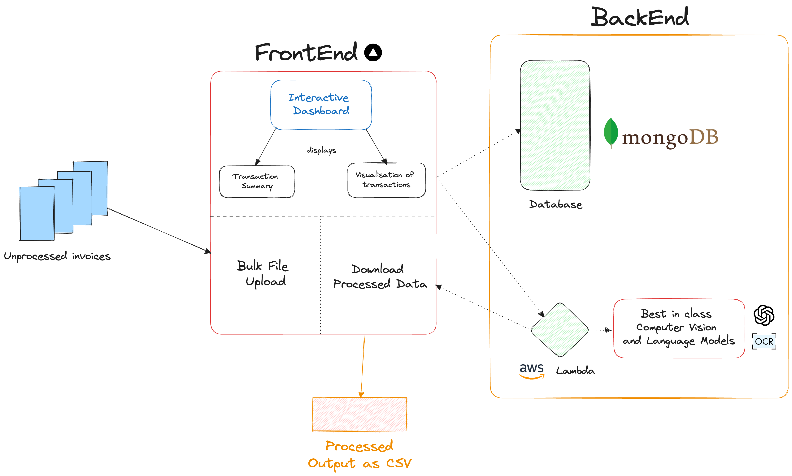

# Invoice-Hub
Introducing Invoice-Hub, your AI-powered receipt and invoice processing assistant! 🤖

Tired of spending hours manually transcribing and organizing your scanned receipts and invoices? Invoice-Hub is here to revolutionize your workflow. This innovative app harnesses the power of artificial intelligence to streamline your administrative tasks in an AI hackathon-worthy fashion.

🧠 AI Magic: Invoice-Hub leverages cutting-edge AI technology to analyze scanned images, extracting text with remarkable precision. It understands and interprets your documents, saving you time and effort. No more tedious data entry or manual typing – let the AI do the heavy lifting.

🚀 Unparalleled Convenience: With Invoice-Hub, you can effortlessly submit batches of scanned receipts and invoices. Invoice-Hub doesn't just extract text; it organizes your data into a structured format. Say goodbye to the time-consuming task of processing images one by one.

📈 Boost Productivity: Invoice-Hub empowers you to quickly mass-produce and organize large volumes of scanned documents, unlocking newfound levels of efficiency. Spend less time on data entry and more time on what truly matters to you.

Experience the future of document management with Invoice-Hub. Harness the power of AI to simplify your life and eliminate the hassle of manual data processing. With Invoice-Hub, you can process large volumes of receipts and invoices in minutes, not hours. Welcome to the era of effortless efficiency!

## Implementation

Invoice-Hub consists of a front-end web application and a back-end API. The front-end and back-end are built with Next.js. The AI service is hosted on AWS Lambda and makes use of AWS Textract, OpenAI and proprietary algorithms. The front-end and back-end are hosted on Vercel.

Our codebase is structured as follows:
- `ml/` contains the AI service code
    - It contains a `setup_artifact.sh` file which compresses the code and the dependencies into a zip file for deployment to AWS Lambda.
    - `models.py` contains the core logic for the AI service.
    - `lambda_function.py` contains the code for the AWS Lambda function.

- `src/dashboard` and `src/pages`contains the front-end code and `src/components` contain the React Components powering our frontend.
- `src/pages/api` contains the back-end code which handles the parsing of the documents and the communication with the AI service.

## Pitch Presentation
[Invoice-Hub Pitch Presentation.webm](https://github.com/geraldngjx/invoice-hub/assets/102348985/131ab6d4-9f0a-469d-96da-b699d33b33d7)

## Meet the Team
Hello! We are a team of 4 Sophomores from the National University of Singapore. We met each other staying in the same accomondation and we are all passionate about technology and are excited to be able to participate in this hackathon.

[Ryan](https://www.linkedin.com/in/ryantzr/) is a dynamic individual with a strong foundation in computer science, complemented by a keen interest in psychology and proficiency in the Spanish language. As a co-founder of Friday Technologies, he has demonstrated his entrepreneurial spirit and commitment to innovation. With a track record of successful internships and roles at organizations like SGInnovate and Google Developer Student Clubs NUS, Ryan has honed his skills in artificial intelligence and product development. His academic excellence, including a projected Honours with Highest Distinction at the National University of Singapore, speaks to his dedication to learning and growth. Ryan's passion for technology and diverse interests make him a promising and multifaceted professional in the field.

[Gerald](https://www.linkedin.com/in/geraldngjx/) is a dedicated Fullstack Software Lead at Fintech Lab, currently pursuing his Computer Science degree at the National University of Singapore (NUS). With a diverse skill set ranging from software development and IT management to project management and event planning, Gerald is a multifaceted talent. He actively contributes to the NUS community, serving as a Teaching Assistant and Student Engagement Executive, all while being deeply involved in the NUS FinTech Lab and NUS Fintech Society. His passion for education is evident in his role as the Founder of Gifted Education, an initiative aimed at helping students excel academically. With a background in teaching and a strong foundation in software engineering, Gerald is making a significant impact on both the academic and technological fronts.

[Wei Hern](https://www.linkedin.com/in/wei-hern-lim-ab98731b9/) is a sophomore at the National University of Singapore, pursuing a double major in Computer Science and Statistics. Currently, he serves as a Research Assistant in Professor Kenji Kawaguchi's lab, where he focuses on enhancing the interpretability and safety of Generative Image Models. Wei Hern also has a strong industry background, having interned at DBS Bank as a Data Science Intern, where he played a pivotal role in developing AI-powered applications and tools for the bank's data science teams. His previous experiences include internships in data analytics and forensics at KPMG Singapore and quantitative financial instrument valuation. Wei Hern is a dedicated scholar, evidenced by his NUS Merit Scholarship, and has earned accolades for his machine learning and hackathon projects.

[Ian](https://www.linkedin.com/in/ian-tay-ye/) is a versatile professional with a strong background in Web3, DeFi, and computer science. Currently serving as a Teaching Assistant for the CS1101S Programming Methodology course at the National University of Singapore, he imparts computational thinking and programming skills to aspiring computer scientists. Ian is also deeply involved in the blockchain industry, working as a Research Analyst for the NUS Fintech Society, where he actively contributes to academia through publications and collaborates with industry partners. As the Director of Internal Affairs for the society, he plays a pivotal role in organizing strategic events and enhancing the community's culture. Ian's commitment to education extends to his freelance work as a private tutor, where he helps students excel in physics and mathematics. With prior experience at Kraken Digital Asset Exchange and the Ministry of Manpower, Ian possesses a rich skill set encompassing cryptocurrency, client engagement, and customer experience. He is pursing a Bachelor's degree in Computer Science from NUS, where he was awarded the NUS Merit Scholarship and engages in personal projects demonstrating his programming prowess.
